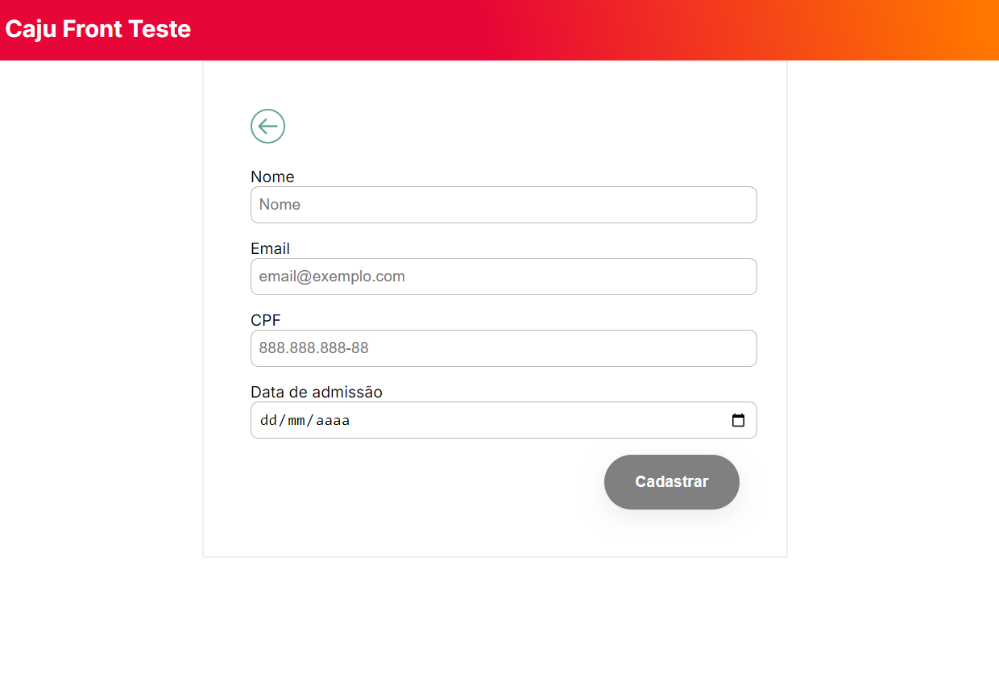
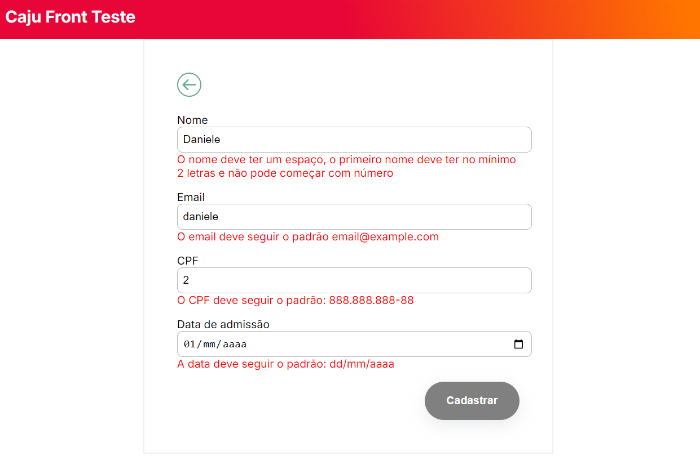
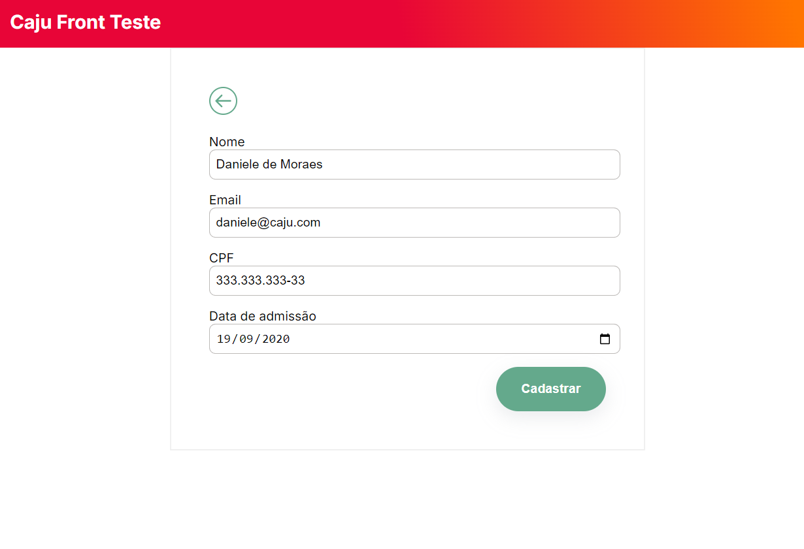
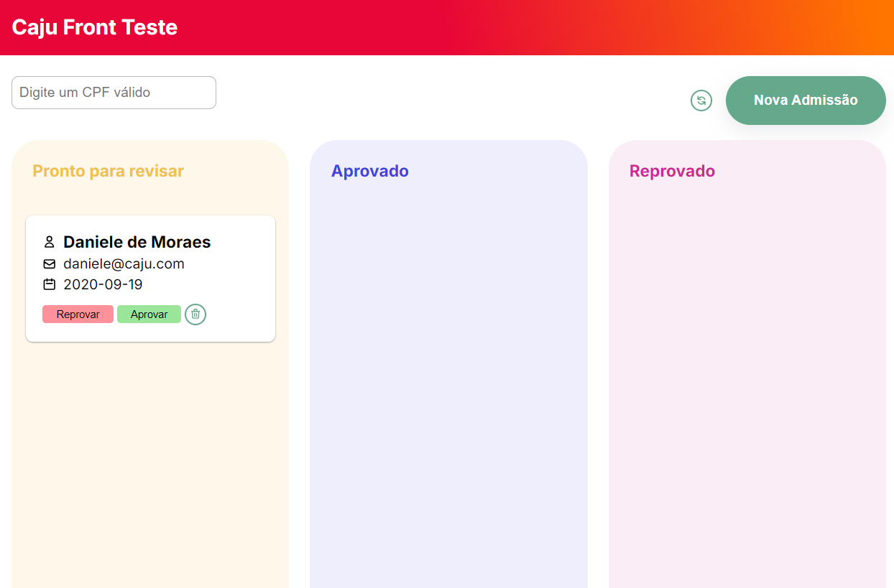
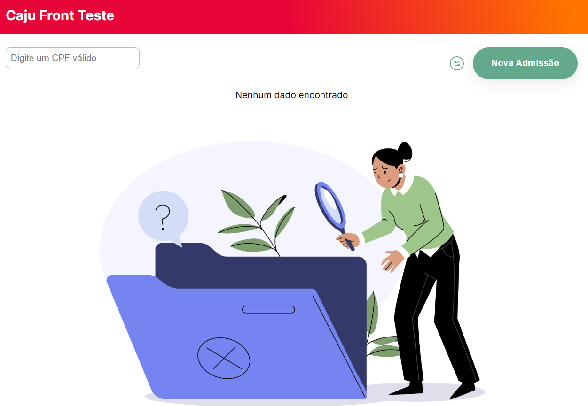
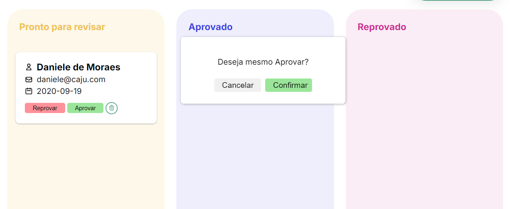
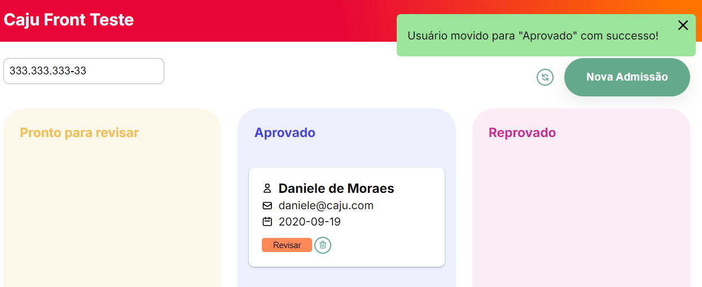

# Caju Front End Teste

Na `Tela de cadastro` é possível cadastrar um usuário novo.

Em caso de erros de validação, são mostradas mensagens para auxiliar o usuário, e enquanto isso o botão de Cadastrar permanece desabilitado

Quando todos os dados estão válidos, o botão de Cadastrar é habilitado

O usuário é criado na coluna `Pronto para revisar`.

A busca é executada apenas quando um CPF válido é digitado (11 dígitos):

Em caso de não haver nenhum resultado, é mostrada uma tela de empty state:

Uma modal de confirmação é mostrada quando o usuário clica nas ações de revisar, aprovar, reprovar e remover um usuário:

Uma snakcbar é mostrada ao executar as ações:

